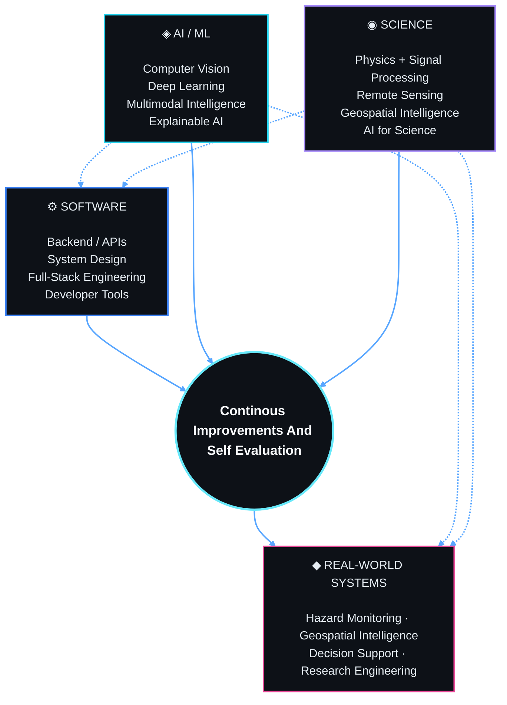

<div align="center">


<br/>

# ISHAN SINGH

### AI/ML · Scientific Computing · Geospatial Intelligence · Software Engineering

<p>
  <a href="https://github.com/ishxn-s11">
    
  </a>
  <a href="https://www.linkedin.com/in/ishan-s25-b82b5037a/">
    
  </a>
  <a href="https://leetcode.com/u/2hWh07Dv3F/">
    
  </a>
  <a href="https://www.kaggle.com/ishxns11">
    
  </a>
  <a href="https://www.hackerrank.com/profile/ishxn_s11">
    
  </a>
  <a href="https://www.instagram.com/ishhx29/">
    
  </a>
</p>

<sub>Building intelligent systems where software, science, data, and real-world problems meet.</sub>

</div>

---

## 01 — About Me 

```yaml
name: Ishan Singh
github: ishxn-s11

role:
  - AI / ML Student
  - Software Developer
  - Research-Oriented Builder

interests:
  - Artificial Intelligence
  - Machine Learning
  - Computer Vision
  - Scientific Computing
  - Geospatial AI
  - Remote Sensing
  - AI for Science
  - Backend Engineering
  - Competitive Programming

currently_learning:
  - Data Structures & Algorithms
  - Deep Learning
  - System Design
  - Django & Backend Engineering
  - MLOps
  - Physics-Informed Machine Learning
```

I build projects that combine **AI/ML, software engineering, scientific computing, geospatial data, and real-world decision systems**.

My current work spans intelligent hazard monitoring, urban heat analysis, satellite-image retrieval, scientific signal processing, autonomous-system safety, and algorithmic problem solving.

---

---

## 02 — The Vision / The Goal / The Purpose



---
## 03 — FEATURED BUILDS

<table>
<tr>
<td width="50%" valign="top">

### AERIS

**AI-Enabled Emergency Risk Intelligence System**

AI + IoT + GIS platform for industrial hazard intelligence, prediction, simulation, monitoring, and emergency response.

`AI/ML` `FastAPI` `React` `GIS` `IoT` `Computer Vision`

</td>
<td width="50%" valign="top">

### Urban Heat Intelligence

AI/ML system for detecting urban heat hotspots, analyzing heat drivers, forecasting risk, and comparing cooling interventions.

`Python` `Earth Engine` `Landsat` `Sentinel-2` `ERA5` `Geospatial AI`

</td>
</tr>

<tr>
<td width="50%" valign="top">

### Cross-Modal Satellite Image Retrieval

Shared embedding system for retrieving semantically related imagery across optical, SAR, multispectral, hyperspectral, and elevation modalities.

[Repository →](https://github.com/ishxn-s11/Cross-Modal-Satellite-Image-Retrieval)

`PyTorch` `Deep Learning` `Remote Sensing` `Multimodal Retrieval`

</td>
<td width="50%" valign="top">

### Gravitational Wave Detection

Scientific signal-processing and ML pipeline for gravitational-wave event detection, denoising, reconstruction, matched filtering, and analysis.

`Python` `GWPy` `PyCBC` `SciPy` `Astropy` `Signal Processing`

</td>
</tr>

<tr>
<td width="50%" valign="top">

### Crowd Shield

Crowd-intelligence system focused on preventing crowd-related accidents using monitoring, risk analysis, and decision support.

[Repository →](https://github.com/ishxn-s11/crowd-shield)

`AI` `Computer Vision` `Safety Systems` `Analytics`

</td>
<td width="50%" valign="top">

### PayFence

Policy-enforcement layer for autonomous and AI-driven payments with configurable controls before transaction settlement.

[Repository →](https://github.com/ishxn-s11/payfence)

`AI Agents` `Payments` `Policy Engine` `APIs` `Security`

</td>
</tr>
</table>

---

## 04 — STACK

### Languages

<div align="center">


</div>

### AI / ML & Data

<div align="center">


<br/><br/>


</div>

### Backend / Web

<div align="center">


</div>

### Geospatial / Scientific

<div align="center">


</div>

### Engineering / Cloud

<div align="center">


</div>

---

## 05 — TELEMETRY

<div align="center">


<br/>


<br/><br/>


</div>

<!--
Your existing update-card.yml workflow is designed to generate ./card.svg daily.
Once card.svg exists in the repository, you can replace or supplement the stats above with:

<div align="center">
  
</div>
-->

---

## 06 — CODING 

<div align="center">

| Platform | Profile | Focus |
| :-- | :-- | :-- |
| [](https://leetcode.com/u/2hWh07Dv3F/) | [2hWh07Dv3F](https://leetcode.com/u/2hWh07Dv3F/) | DSA · Algorithms · Competitive Programming |
| [](https://codeforces.com/profile/ishxn.s11) | [ishxn.s11](https://codeforces.com/profile/ishxn.s11) | Competitive Programming · Contests · Problem Solving |
| [](https://www.deep-ml.com/profile/Y0DjDVAGhQb4AqkdNOh1es9m0WH2) | [Y0DjDVAGhQb4AqkdNOh1es9m0WH2](https://www.deep-ml.com/profile/Y0DjDVAGhQb4AqkdNOh1es9m0WH2) | Machine Learning · Linear Algebra · ML Practice |
| [](https://www.hackerrank.com/profile/ishxn_s11) | [ishxn_s11](https://www.hackerrank.com/profile/ishxn_s11) | Algorithms · Python · SQL |
| [](https://www.kaggle.com/ishxns11) | [ishxns11](https://www.kaggle.com/ishxns11) | AI/ML · Data Science · Computer Vision |
| [](https://builder.aws.com/profile?tab=badges) | [Builder Profile](https://builder.aws.com/profile?tab=badges) | AWS Learning · Cloud · Badges |
| [](https://github.com/ishxn-s11) | [ishxn-s11](https://github.com/ishxn-s11) | Software Engineering · Open Source · Research |

</div>

<br/>

<div align="center">


</div>

<div align="center>
  


</div>

## 07 — CERTIFICATES & Other Stuffs

<div align="center">

A collection of certificates and learning credentials from courses, programs, challenges, and technical activities.

<br/>

<a href="./certs/">
  
</a>

</div>

<br/>

<div align="center">

<table>

<tr>

<td width="50%" align="center">

### Certificate 01

[](./certs/1c651850-53df-4009-ac4d-69e237198134.pdf)

</td>

<td width="50%" align="center">

### Certificate 02

[](./certs/506d77ba-9147-45b9-ab76-b2af8f524b8f.pdf)

</td>

</tr>

<tr>

<td width="50%" align="center">

### Certificate 03

[](./certs/82c655b2-f462-4d8f-a275-d416b4713740.pdf)

</td>

<td width="50%" align="center">

### IBM Design Certificate

[](./certs/IBMDesign20261002-21-x9g1sf.pdf)

</td>

</tr>

<tr>

<td width="50%" align="center">

### Certificate 05

[](./certs/b6deb2c8-b935-4144-9cf7-841ba7dee59f.pdf)

</td>

<td width="50%" align="center">

### Certificate 06

[](./certs/b75ba153-f371-446b-8123-39ec9074835a.pdf)

</td>

</tr>

<tr>

<td width="50%" align="center">

### Certificate 07

[](./certs/dd6fe886-950c-4067-9988-3a053e76e36a.pdf)

</td>

<td width="50%" align="center">

### Certificate 08

[](./certs/ed33096a-de62-4d23-a149-f5dd21bc3a35.pdf)

</td>

</tr>

<tr>

<td colspan="2" align="center">

### TB Mukt Bharat Abhiyan — Quiz Certificate

[](./certs/Quiz%20on%20TB%20Mukt%20Bharat%20Abhiyan_Certificate_Ishan%20Singh.png)

</tr>

<tr>
<td colspan="2" align="center">

### NASA Adopt A Pixel

[](./certs/WhatsApp%Image%2026-10-03%at%12.04.24%AM.jpeg)

</td>

</tr>

</table>
</div>
---

## 08 — CURRENT ROUTE

```text
NOW
│
├── Strengthening DSA + Competitive Programming
├── Mastering Python OOP and backend engineering
├── Building Django / FastAPI systems
├── Advancing Deep Learning + Computer Vision
├── Exploring AI for Science
├── Working with Earth observation + geospatial ML
└── Turning research prototypes into deployable systems
│
▼
NEXT
│
├── Stronger MLOps pipelines
├── Production AI systems
├── Open-source contributions
├── Research engineering
└── Quantitative / algorithmic problem solving
```

---

## 09 — CONNECT

<div align="center">

<a href="https://www.linkedin.com/in/ishan-s25-b82b5037a/">
  
</a>

<a href="https://github.com/ishxn-s11">
  
</a>

<a href="https://www.instagram.com/ishhx29/">
  
</a>

<br/><br/>

<sub>
Interested in AI/ML, scientific computing, intelligent systems, open source, research engineering, and ambitious technical projects.
</sub>

<br/><br/>

### `BUILD → TEST → LEARN → ITERATE`

</div>
